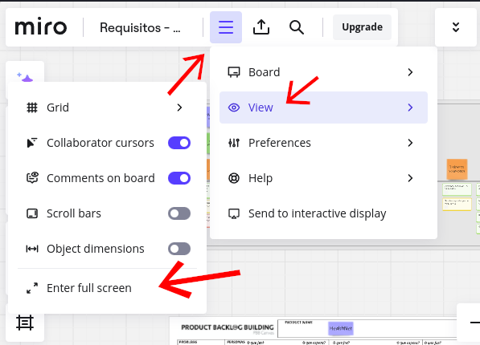
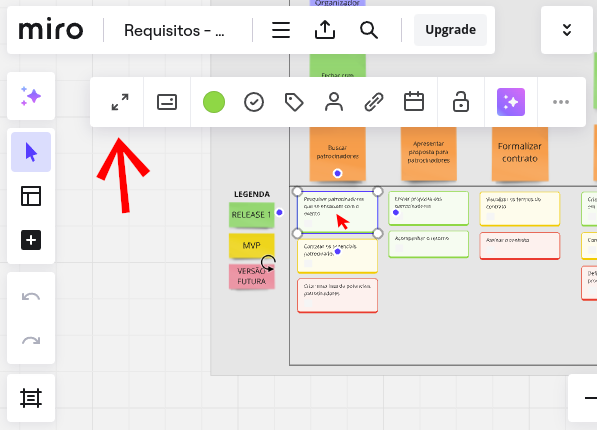
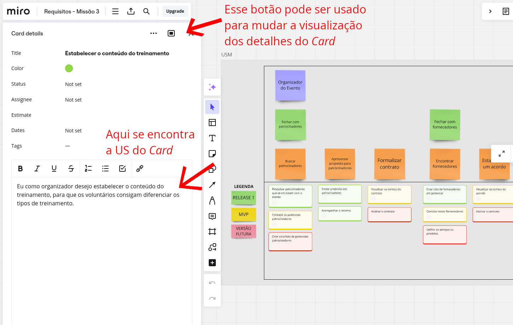

**User Story Mapping (USM)** é uma técnica de visualização usada para entender as necessidades e jornadas dos usuários ao interagir com um produto ou serviço. Ela ajuda equipes de desenvolvimento, designers e stakeholders a organizarem e priorizarem as funcionalidades e requisitos do produto de forma colaborativa.

## ComunEventos 

A ComunEventos é uma startup criada por três jovens empreendedores que, após participar de eventos comunitários, identificaram a necessidade de otimizar a experiência para organizadores e participantes. A missão da empresa é desenvolver uma plataforma online que facilite a organização e promoção desses eventos, promovendo um ecossistema digital para que a comunidade se conecte e participe de atividades que reflitam seus valores. Eventos comunitários, como feiras, workshops e atividades culturais, são importantes para fortalecer laços sociais e promover a coesão na comunidade, permitindo que as pessoas se conectem, aprendam e trabalhem juntas para melhorar seu ambiente. 

A plataforma irá permitir que Organizadores de Eventos consigam contatar Patrocinadores e Voluntários para organizar os eventos e também promovê-los por meio da plataforma, para que os Participantes interessados consigam ver os detalhes dos eventos, comprar ingressos e ir aos eventos.

## USM:

<iframe width="768" height="432" src="https://miro.com/app/live-embed/uXjVKmAWbH4=/?moveToViewport=-68784,64516,79636,18820&embedId=248765000082" frameborder="0" scrolling="no" allow="fullscreen; clipboard-read; clipboard-write" allowfullscreen></iframe>

Foram produzidas 88 Histórias de Usuários, portanto nas tabelas abaixo só foi possível apresentar os Títulos. Para verificar as Histórias de Usuário é necessário expandir os Cards de Título de História de Usuário no Miro (acima), conforme o tutorial:

## Como verificar as Histórias de Usuário:

Primeiramente, coloque em tela cheia para facilitar a visualização:
{: style="height:auto", width="100%"}

Aproxime do Card que deseja verificar a US, em seguida selecione-o, por fim, aperte o botão com ícone de Expadir:
{: style="height:auto", width="100%"}

Desça até a descrição do Card, onde se encontra a História de Usuário:
{: style="height:auto", width="100%"}

<strong>Observação: </strong>Caso seja necessário necessário fazer auditoria do último horário onde foram realizadas modificações no quadro Miro para verificar fraude, por favor entrar em contato com a equipe, pois apenas membros com permissão de edição conseguem visualizar o histórico do quadro. E a mensagem de "Última Modificação" apresentada ao abrir o quadro, geralmente é atualizada mesmo sem modificações relevantes.
 

## Histórico de Versão

| Versão | Data       | Descrição                                                         | Autor(es)       |
|--------|------------|-------------------------------------------------------------------|-----------------|
| 1.0   | 09/09/2024 |  Adicionando USM corrigido                             | Grupo   |
